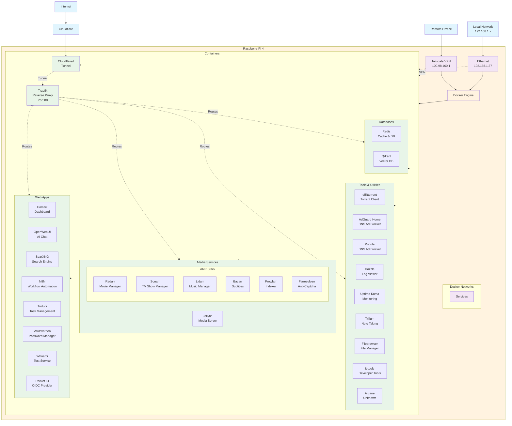

## Service Inventory

This section provides a comprehensive list of all deployed services with brief descriptions:

### Core Infrastructure

- **Traefik**: Reverse proxy and load balancer for routing traffic to services.
- **Cloudflared**: Cloudflare tunnel service for secure external access.

### Web Applications

- **Homarr**: Dashboard for organizing and accessing self-hosted services.
- **OpenWebUI**: Web interface for interacting with AI models (integrates with Redis).
- **SearXNG**: Privacy-focused metasearch engine (integrates with Redis).
- **N8N**: Workflow automation and integration platform.
- **Tududi**: Task and project management application.
- **Vaultwarden**: Lightweight password manager compatible with Bitwarden.
- **Whoami**: Simple test service for verifying configurations.
- **Pocket ID**: OIDC provider for passkey-based authentication.

### Media Services

- **Jellyfin**: Media server for streaming movies, TV shows, and music.
- **ARR Stack**:
  - **Radarr**: Automated movie download and management.
  - **Sonarr**: Automated TV show download and management.
  - **Lidarr**: Automated music download and management.
  - **Bazarr**: Subtitle management for media libraries.
  - **Prowlarr**: Indexer manager for torrent and Usenet sources.
  - **Flaresolverr**: Anti-bot service for accessing protected sites.

### Tools & Utilities

- **qBittorrent**: Torrent client for downloading files.
- **AdGuard Home**: Network-wide ad and tracker blocker.
- **Pi-hole**: DNS-based ad blocker and network monitoring.
- **Dozzle**: Real-time Docker container log viewer.
- **Uptime Kuma**: Self-hosted uptime monitoring and alerting.
- **Trilium**: Hierarchical note-taking application.
- **Filebrowser**: Web-based file manager for browsing and managing files on shared storage.
- **it-tools**: Collection of online developer tools for formatting, conversion, and testing.
- **Arcane**: Custom or specialized service (purpose TBD).

### Databases

- **Redis**: In-memory data structure store used for caching and sessions.
- **Qdrant**: Vector database for similarity search and AI applications.

## Docker Compose Structure

The repository is organized using multiple docker-compose files for modularity:

- `docker-compose.yml`: Core services and primary setup.
- `docker-compose.ai.yml`: AI-related services (OpenWebUI, Qdrant).
- `docker-compose.arr.yml`: ARR media management stack.
- `docker-compose.databases.yml`: Database services (Redis, Qdrant).
- `docker-compose.monitor.yml`: Monitoring and logging services (Uptime Kuma, Dozzle).
- `docker-compose.system.yml`: System infrastructure (Traefik, Cloudflared).

Each service has its own directory under `services/` containing its docker-compose.yml and configuration files.

## Maintenance Guidelines

- **Updates**: Revise this document whenever services are added, removed, or modified.
- **Descriptions**: Ensure service descriptions remain accurate and reflect current functionality.
- **Diagram**: Update the Mermaid diagram to include new services or changes in architecture.
- **Versioning**: Consider versioning the document or linking to commit history for tracking changes.
- **Automation**: Explore tools to auto-generate service lists from docker-compose files for consistency.
